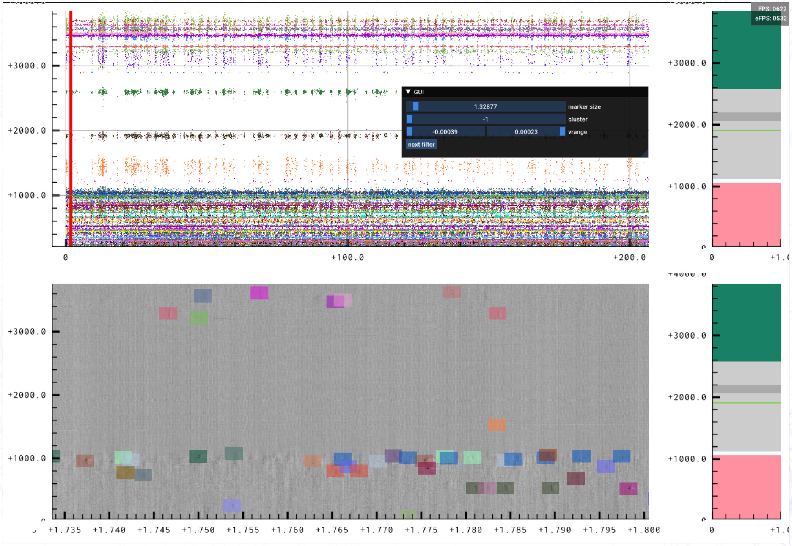
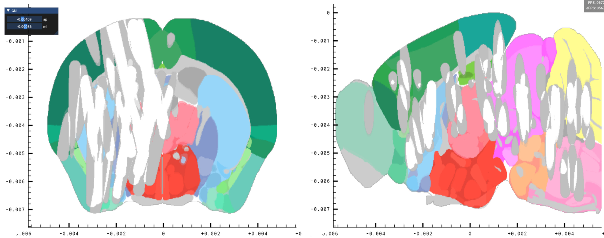
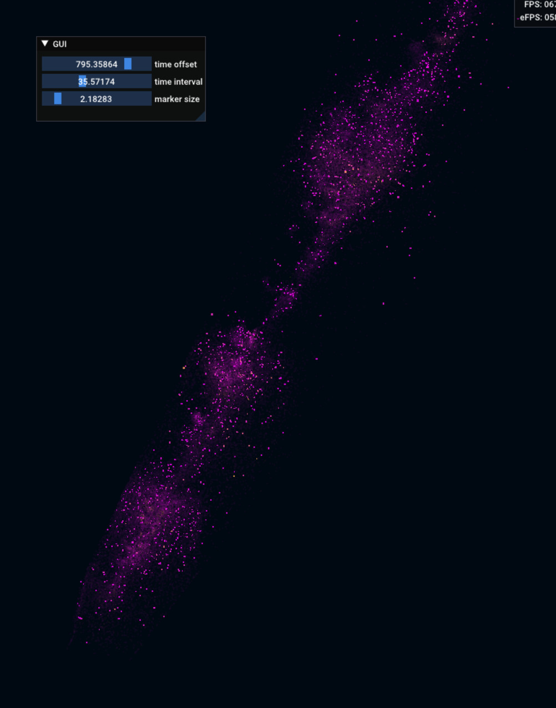

# Datoviz experiments and prototypes

This repository contains various ongoing experiments and GUI prototypes.

All prototypes are experimental. Use at your own risks!

## IBL prototypes

### Ephys data viewer

* File: `ephysview.py`
* Requires: `ibllib@develop`
* Description: shows the full raster plot of an ephys session at the top, and a small section of the raw data on the bottom.
* Use: control+click in the top panel to select a particular time, and load (download + on-the-fly decompression) the corresponding chunk of raw data in the bottom panel.

### Coverage viewer

* File: `coverage.py`
* Requires: `coverage.npy`

### Spike localization viewer

* File: `spikeloc.py`

## Other prototypes

* **High-res humain brain viewer**: `brain_highres.py`
* **Molecule viewer**: `molecule.py`
